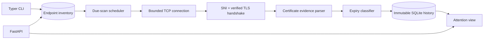

# CertGuardian

**Cybersecurity · PKI · DevOps · Operations**

CertGuardian is a lightweight TLS certificate inventory and evidence system for teams that cannot afford to discover expiry through an outage.

## Problem

Certificates protecting websites, APIs, VPNs, reverse proxies, dashboards, and internal applications often live in spreadsheets, calendars, or an administrator's memory. A certificate can remain unnoticed for months and then break browsers, clients, and integrations when it expires.

## Who This Helps

Small infrastructure, platform, security, and IT operations teams responsible for multiple TLS endpoints without an enterprise certificate-management platform.

## Why It Matters

Expiry causes avoidable outages and emergency renewals. Inventory alone is insufficient: operators need evidence of what the endpoint actually presented, whether the hostname matched, how validity changed over time, and which owner must act.

## Constraints

The system must run without a paid service, private CA integration, or certificate files. It observes endpoints from one network vantage point, uses the operating-system CA trust store, stores evidence locally in SQLite, and never claims it can renew certificates.

## Solution

Operators register named endpoints with an owner, port, scan interval, and thresholds. An SNI-aware scanner performs a verified TLS handshake and records issuer, subject, SANs, validity, serial number, protocol, cipher, SHA-256 fingerprint, hostname validity, remaining days, and bounded failures. A scheduler scans only endpoints whose interval is due. Historical results remain immutable and the attention view is derived from the latest evidence.

## Architecture



See [architecture](docs/architecture.md), [security](docs/security.md), and [threat model](docs/threat-model.md).

## Implemented Features

- Named inventory with host, port, owner, enablement, interval, and thresholds.
- TLS chain trust and hostname validation through the platform SSL context.
- Issuer, subject, SAN, serial, validity, protocol, cipher, and SHA-256 fingerprint evidence.
- Default `30, 15, 10, 5, 3, 2, 1` day thresholds and custom per-endpoint thresholds.
- `HEALTHY`, `DUE`, `EXPIRED`, and `ERROR` scan states.
- Due-only scheduling, continuous supervised polling, immutable history, and attention listing.
- CLI for one-shot scans, inventory registration, persisted scans, due listing, and watch mode.
- REST inventory, scan, due-scan, history, alert, and health endpoints.
- Non-root, read-only container deployment with durable SQLite storage.

## Technology Stack

Python's `ssl` and `socket` libraries provide SNI-aware verified handshakes without invoking OpenSSL as a shell command. SQLite provides inexpensive evidence retention. FastAPI validates HTTP input and publishes OpenAPI. Typer provides operational commands. Pytest uses injected scanners and network mocks for deterministic behavior.

## Setup

```bash
python -m venv .venv
. .venv/bin/activate
pip install -e '.[dev]'
```

## Usage

```bash
certguardian scan example.com
certguardian add public-site example.com --owner platform
certguardian run 1
certguardian due
certguardian watch --poll-seconds 60
```

```bash
CERTGUARDIAN_DB=./data/certguardian.db uvicorn app.api:app --host 127.0.0.1 --port 8001
curl -X POST http://127.0.0.1:8001/endpoints -H 'content-type: application/json' \
  -d '{"name":"public-site","host":"example.com","owner":"platform","thresholds":[30,15,10,5,3,2,1]}'
curl -X POST http://127.0.0.1:8001/endpoints/1/scan
curl http://127.0.0.1:8001/alerts
```

Container:

```bash
docker compose up --build -d
curl http://127.0.0.1:8001/health
```

## Testing

```bash
pytest -q
python -m compileall -q app tests
```

Tests cover exact threshold boundaries, inventory validation, durable history, scheduling intervals, failure evidence, continuous polling, and REST workflows without depending on a public certificate.

## Security

Endpoint registration triggers outbound TCP and TLS activity and must be administrative. Compose binds to loopback, but remote deployments require authenticated authorization and egress rules. The scanner uses the platform CA store, SNI, and hostname validation; it never disables verification. Stored topology and certificate metadata may be sensitive. See the security document for operational controls.

## Limitations

- Does not discover endpoints, issue certificates, renew certificates, modify DNS, or integrate with a CA.
- Observes only the certificate presented from its network path and SNI value.
- Does not implement OCSP/CRL policy, Certificate Transparency monitoring, or full chain archival.
- SQLite and the polling process are a single availability domain.
- Notification delivery is intentionally separate; `/alerts` provides actionable state for an external notifier.

## Contributing

Read [CONTRIBUTING.md](CONTRIBUTING.md). Scanner changes must include deterministic certificate or mocked-network evidence and must not weaken TLS verification.
