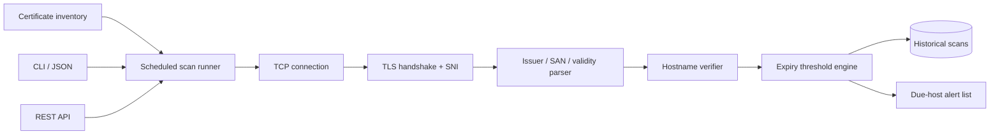

# CertGuardian Architecture

## System context

CertGuardian begins with an explicit endpoint inventory. A scheduled runner opens a bounded TCP connection and performs an SNI-aware TLS handshake using the platform trust store. The scanner extracts issuer, SAN, and validity evidence before hostname verification and expiry classification. Immutable scan results are stored as history; the inventory derives attention lists from the latest result instead of overwriting evidence.

## Component diagram

## Data and control flow

The solid arrows show runtime data or control flow. Dotted arrows, where present, describe policy rather than runtime connectivity. Domain decisions remain independent of CLI and HTTP delivery so they can be tested without binding sockets or paid services. Inputs are validated before persistence or outbound I/O, and evidence is retained at the point where the system makes an operational decision.

## Trust boundaries

1. **External input boundary:** network targets, telemetry, identity requests, documents, logs, or field records are untrusted.
2. **Domain boundary:** validated values enter deterministic policy and state-transition logic.
3. **Persistence boundary:** parameterized or structured writes protect stored operational evidence.
4. **Operator boundary:** alerts, conflict choices, infrastructure deployment, and other consequential actions remain explicit operator responsibilities.

## Failure behavior

Adapters return explicit errors or states rather than manufacturing successful results. Timeouts and unavailable dependencies affect only the relevant operation. The limitations documented in the README define what cannot be inferred from the available evidence.
