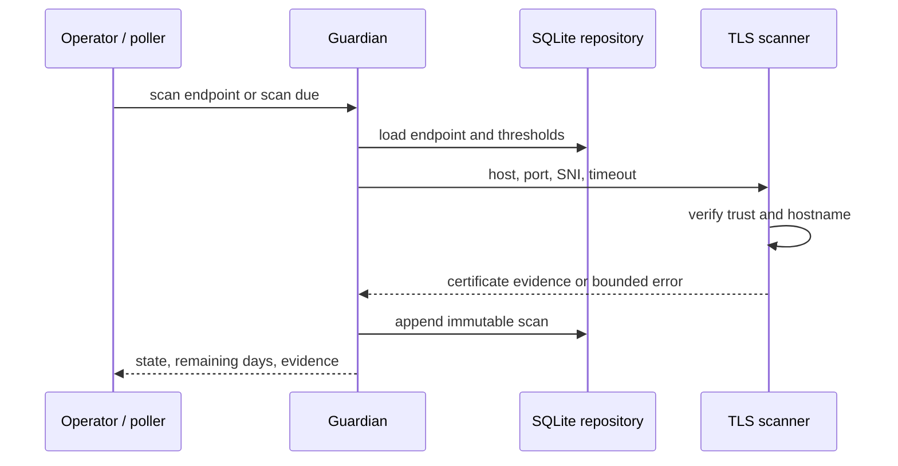

# CertGuardian Architecture

## System context

CertGuardian separates inventory, network observation, expiry policy, and presentation. Endpoint definitions persist independently from scan results. The scheduler selects only due endpoints, the scanner produces immutable evidence from a verified handshake, and attention state is computed from the latest record rather than maintained as mutable duplicate data.

## Persistence

`endpoints` contains unique names, destination, owner, polling interval, thresholds, and enablement. `scans` contains a foreign key, indexed timestamp, summary state, hostname decision, and the complete JSON result. Removing an endpoint cascades only its related evidence. Latest state and attention views are queries, preventing stale parallel state.

## Scheduling and state

An endpoint with no history is due immediately. Otherwise its latest timestamp plus its interval determines eligibility. Negative remaining days are `EXPIRED`; a non-negative value at or inside the smallest matching configured boundary is `DUE`; later values are `HEALTHY`. Connection, trust, hostname, parsing, and timeout failures become `ERROR` evidence rather than disappearing from history.

## Trust boundaries

Inventory writers can cause outbound connections and must be trusted. DNS, the remote endpoint, and presented certificate are untrusted until the platform SSL context verifies trust and hostname. SQLite contains sensitive topology and operational evidence. API and CLI callers receive bounded error details, not tracebacks.
